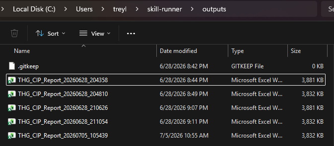

# Capstone Project Checklist

**Project:** Deterministic Skill-Runner for Reporting Pipeline  

 Mark items `- [x]` when complete.

## Scope

### In scope

- [x] Requirements elicitation for at least one representative reporting use case (CIP / construction-in-process report)
- [x] Skill-runner architecture designed (GitHub skills repo + deterministic Python scripts)
- [x] Proof-of-concept pipeline: read sample data → invoke skills → run scripts → produce report files
- [x] Basic evaluation: reproducibility, runtime, maintainability (pilot runs + logs)

### Out of scope (explicitly deferred)

- [ ] Full production hardening — **not in this phase**
- [ ] Enterprise-wide change management — **not in this phase**
- [ ] Comprehensive security review — **not in this phase**
- [ ] Full-featured UI beyond minimal run/monitor controls — **not in this phase**

---

## SMART goals

### Goal 1 — Prototype delivery (Specific, Time-bound)

- [x] Working skill-runner prototype implemented
- [x] At least one standardized report generated from sample data
- [x] No interactive chat session required during execution

### Goal 2 — Reproducibility (Measurable)

- [x] Five consecutive runs completed with same input + configuration
- [x] Outputs consistent across runs (differences limited to acceptable formatting variation)
- [x] Reconciliation / validation step passes on each run

### Goal 3 — Efficiency (Measurable, Relevant)

- [ ] Before-and-after comparison documented (manual steps vs single pipeline run)
- [ ] Measurable reduction in analyst effort for the selected report

### Goal 4 — Documentation & maintainability (Achievable, Relevant)

- [ ] Architecture documented
- [ ] Configuration and execution steps documented
- [ ] Another technical team member could run and modify the pipeline from docs alone

---

## Expected deliverables

- [ ] Skill-runner architecture diagram and description
- [ ] Working prototype (sample data → skills/scripts → finished reports in secure output location)
- [ ] Evaluation results: reproducibility + efficiency
- [ ] Reflection on scaling to other reports and production hardening requirements

---

## Project lifecycle phases (Gantt-aligned)

### 1. Initiation Phase — Initiation, problem definition, Literature review & requirements
- [ ] Problem statement finalized
- [ ] Stakeholders and constraints identified
- [ ] Scope statement written
- [ ] Research on LLM-in-pipeline / ETL patterns reviewed
- [ ] Representative use case selected (CIP report)
- [ ] Input data requirements documented (Aspire Opportunity export)

### 2. Planning Phase — Architecture & scope design
- [ ] Architecture defined: n8n trigger → runner API → OpenRouter orchestration → packaged `.skill` → Python build script
- [ ] Data folder, output folder, and config strategy defined
- [ ] Packaged `.skill` file as source of truth (extract to cache at runtime)

###  3. Execution — Prototype development
- [ ] GitHub repository created (`skill-runner`)
- [ ] Packaged skill stored in repo (`skills/*.skill`)
- [ ] Runner API implemented (inspect, orchestrate, build, `/run`)
- [ ] OpenRouter integration for pre-flight orchestration
- [ ] Runtime config in markdown (`runner/cip-orchestration.md`) for division/date defaults
- [ ] n8n workflow created and tested locally
- [ ] Sample/anonymized data used for development
- [ ] End-to-end pipeline run succeeds
- [ ] Completed-tab date window validated (YTD default)
- [ ] Division filter validated (Construction-only default)
- [ ] Five-run reproducibility test executed and recorded
- [ ] Runtime and log output captured

### 4. Monitoring — Draft preparation
- [ ] Capstone draft written from prototype results
- [ ] Architecture and evaluation sections updated with actual outcomes

###  5. Closure — Final submission
- [ ] Final capstone document submitted
- [ ] Repository cleaned and documented for reviewer access

---

## Technical implementation checklist (skill-runner)

- [x] Packaged `.skill` file committed (not extracted source in repo)
- [x] Skill loader extracts to `.runner-cache/` on demand
- [x] Local runner API on port 8787
- [x] `DATA_DIR` / `OUTPUT_DIR` configurable via `.env`
- [x] OpenRouter orchestration with markdown-driven defaults
- [x] n8n workflow (`n8n/cip-report-pipeline.json`)
- [x] First successful CIP report generated from anonymized sample data
- [ ] Run log: data source, skill package, script version, timestamp per execution
- [ ] Five consecutive reproducibility runs documented
- [ ] Before/after efficiency comparison documented

---

## Resources

- [x] GitHub repository for version control
- [x] Python runtime and dependencies (`requirements.txt`)
- [x] LLM skill file (packaged `.skill`)
- [x] Sample operational data (anonymized Aspire export)
- [x] Secure output folder for generated reports
- [ ] Private repo access controls verified (role-based)
- [ ] Gantt chart maintained and current

---

## Ethical considerations

- [ ] Sensitive data handled per organizational policy
- [ ] AI-generated outputs not presented as unquestionable truth
- [ ] Human-in-the-loop validation before external distribution
- [ ] AI disclaimer included with generated reports
- [x] Anonymized or synthetic sample data used in prototype

---

## Security & mitigation

- [x] API keys stored in `.env` (not committed)
- [ ] `.env.example` contains placeholders only (no live secrets)
- [ ] Private GitHub repository with role-based access
- [ ] Credentials in environment variables / secrets manager — not in code
- [ ] Pipeline run logging for audit (source, skill, version, timestamp)
- [ ] Human review required before sharing reports outside project team
- [ ] Least-privilege access to data folders and outputs

---

## Feasibility assessment

| Dimension   | Planned rating | Status | Notes                                                |
| ----------- | -------------- | ------ | ---------------------------------------------------- |
| Technical   | High           |        | Python, GitHub, skills, n8n — no exotic infra        |
| Operational | High           |        | Fits existing BI reporting patterns; single use case |
| Economic    | High           |        | Tools in place; incremental LLM cost is small        |
| Schedule    | Medium         |        | Seven-week window — scope control critical           |

- [ ] Feasibility checklist reviewed at initiation
- [ ] Scope creep actively guarded (Oguz)
- [ ] Schedule risks tracked on Gantt

---

## Acceptance criteria (closure)

- [ ] Prototype generates at least one report without chat during execution
- [ ] Reproducibility demonstrated (≥ 5 consistent runs)
- [ ] Documentation sufficient for handoff
- [ ] Ethical/security mitigations implemented for prototype phase
- [ ] Evaluation and scaling reflection completed

---

## Notes

*Add run dates, output file paths, test results, and blockers here.*

| Date | Milestone                     | Result |
| ---- | ----------------------------- | ------ |
|      | First end-to-end n8n run      |        |
|      | Construction-only + YTD run   |        |
|      | Five-run reproducibility test |        |

