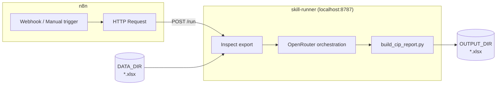

# skill-runner

Run Cursor Agent Skills locally and trigger them from **n8n**, with **OpenRouter** orchestrating multi-step skill decisions.

The first bundled skill is **CIP Report v06-03-26** — it builds a THG Construction In Process Excel workbook from an Aspire Opportunity export.

## Architecture



1. Drop an Aspire Opportunity `.xlsx` into your data folder.
2. n8n calls `POST /run` on the local runner.
3. The runner inspects the export, asks OpenRouter to choose pre-flight settings (branch, division, date windows, margins, etc.), then runs the bundled Python build script.
4. The finished workbook lands in `OUTPUT_DIR`.

## Quick start

### 1. Install

```powershell
cd C:\Users\treyl\skill-runner
python -m venv .venv
.\.venv\Scripts\Activate.ps1
pip install -r requirements.txt
copy .env.example .env
```

Edit `.env`:

- `OPENROUTER_API_KEY` — from [openrouter.ai/keys](https://openrouter.ai/keys)
- `DATA_DIR` — folder with your Aspire exports (can be any path)
- `OUTPUT_DIR` — where finished CIP workbooks are written
- `LOGO_PATH` — optional THG logo PNG; leave blank for `--no-logo`

### 2. Add data

Copy your Aspire Opportunity export into the data folder:

```powershell
copy "C:\path\to\Client_Opportunity.xlsx" "C:\Users\treyl\skill-runner\data\"
```

If multiple files exist, the runner uses the **newest** `.xlsx` unless you pass `filename` in the request.

### 3. Start the runner API

```powershell
python run_server.py
```

Health check: [http://127.0.0.1:8787/health](http://127.0.0.1:8787/health)

### 4. Import the n8n workflow

1. Open your local n8n instance.
2. **Workflows → Import from File** → select `n8n/cip-report-pipeline.json`.
3. In the **Run CIP pipeline** node, set the URL:
   - **n8n in Docker** (most local installs): `http://host.docker.internal:8787/run`
   - n8n running directly on Windows (not Docker): `http://127.0.0.1:8787/run`

   Using `127.0.0.1` from inside a Docker container points at the container itself, not your PC — that causes "connection refused".
4. Activate the workflow or use **Test workflow**.

### 5. Trigger options

**Manual test** — click *Test workflow* in n8n.

**Webhook** — POST JSON to the workflow webhook URL:

```json
{
  "filename": "Client_Opportunity.xlsx",
  "client_name": "Acme Corp",
  "user": "Trey",
  "overrides": {
    "completed_range": "ytd",
    "sub_margin": 0.281
  }
}
```

Omit `filename` to use the newest file in `DATA_DIR`.

## CLI (without n8n)

```powershell
# Inspect export metadata
python -m runner.cli inspect

# OpenRouter chooses build settings only
python -m runner.cli orchestrate --client-name "Acme Corp"

# Full pipeline
python -m runner.cli run --client-name "Acme Corp"
```

## API endpoints

| Method | Path | Purpose |
|--------|------|---------|
| GET | `/health` | Liveness |
| GET | `/data` | List `.xlsx` files in `DATA_DIR` |
| POST | `/inspect` | Read export headers and value counts |
| POST | `/orchestrate` | OpenRouter pre-flight decisions |
| POST | `/build` | Run build with explicit config |
| POST | `/run` | Inspect → orchestrate → build |

### POST `/run` body

```json
{
  "filename": "optional.xlsx",
  "client_name": "Client Name",
  "user": "Trey",
  "overrides": {
    "divisions": ["Construction", "Enhancement"],
    "completed_range": "this_month",
    "overview_range": "last_12_complete_months",
    "sub_margin": 0.281,
    "cost_pace_threshold": 0.05
  }
}
```

## Linking your own data folder

Set `DATA_DIR` in `.env` to any folder on disk:

```env
DATA_DIR=C:/Users/treyl/THG/aspire-exports
OUTPUT_DIR=C:/Users/treyl/THG/cip-reports
```

Restart `run_server.py` after changing env vars.

If n8n runs in Docker and your data lives on the host, either:

- point `DATA_DIR` at a path the runner can read directly (runner stays on the host), or
- mount the host folder into the n8n container only for visibility — the runner still reads files via its own `DATA_DIR`.

## OpenRouter orchestration

The runner sends the skill's **Pre-Flight Checks** section plus **`runner/cip-orchestration.md`** (pipeline defaults: YTD completed window, all divisions) and export inspection data to OpenRouter.

If `OPENROUTER_API_KEY` is missing, the runner falls back to skill defaults (all divisions, standard windows, 28.1% sub margin).

Recommended models (set in `.env`):

```env
OPENROUTER_MODEL=anthropic/claude-sonnet-4
```

## Skill packaging

The skill ships as a single packaged file:

```
skills/cip-report-06-03-26-tl.skill
```

That file is a ZIP archive (Cursor’s skill format). **skill-runner does not use Cursor** — on startup or first run it extracts the package into `.runner-cache/` (gitignored) and runs the build script from there.

To update the skill, replace the `.skill` file and restart the runner. If the package is newer than the cache, it re-extracts automatically.

Pipeline-only LLM overrides and **runtime defaults** (divisions, date windows, etc.) live in `runner/cip-orchestration.md`. Edit the **Runtime config** JSON block there to change defaults without code changes — the file is read on every run.

Optional `.env` paths:

```env
SKILL_PACKAGE=C:/Users/treyl/skill-runner/skills/cip-report-06-03-26-tl.skill
SKILL_CACHE_DIR=C:/Users/treyl/skill-runner/.runner-cache/cip-report-06-03-26-tl
```

Interactive skill steps that required `ask_user_input_v0` are replaced by OpenRouter in this pipeline.

See **[CAPSTONE-CHECKLIST.md](CAPSTONE-CHECKLIST.md)** for capstone deliverable tracking against the Unit 2 project plan.

## AI disclaimer

Delivered reports should include:

> Please note: this report was generated by AI and should be validated before use. While the calculations and formatting follow a tested template, AI can occasionally make mistakes with formatting, formulas, or data output. I recommend spot-checking key totals against your source data before distributing.
