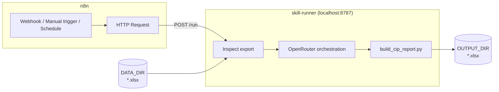

# skill-runner

Run Agent Skills locally and trigger them from **n8n**, with **OpenRouter** orchestrating multi-step skill decisions.

The first bundled skill is **CIP Report v06-03-26** — it builds a THG Construction In Process Excel workbook from an Aspire Opportunity export.

## Prototype

End-to-end run via n8n: manual trigger → local runner → CIP workbook (~7k rows in, report out in ~2 minutes).


## How it works



1. Put an Aspire Opportunity `.xlsx` in your data folder.
2. n8n calls `POST /run` on the local runner.
3. The runner inspects the export, asks OpenRouter for pre-flight settings, then runs the build script.
4. The finished workbook lands in `OUTPUT_DIR`.

## Setup

```powershell
cd C:\Users\treyl\skill-runner
python -m venv .venv
.\.venv\Scripts\Activate.ps1
pip install -r requirements.txt
copy .env.example .env
```

In `.env`, set `OPENROUTER_API_KEY`, `DATA_DIR`, and `OUTPUT_DIR`. Optional: `LOGO_PATH` for the THG logo (blank = no logo).

Drop your export in the data folder, then start the API:

```powershell
python run_server.py
```

Health check: [http://127.0.0.1:8787/health](http://127.0.0.1:8787/health)

## n8n

Start n8n:

```powershell
cd C:\Users\treyl
npx n8n start
```

Add your n8n API key to `.env` (create one in n8n: **Settings → n8n API**):

```env
N8N_API_KEY=your-key-here
N8N_BASE_URL=http://127.0.0.1:5678/api/v1
```

Push workflow changes without re-importing:

```powershell
python -m runner.cli n8n-sync
```

On first sync the workflow is created; later runs update it by name (or set `N8N_WORKFLOW_ID` in `.env`).

Set the **Run CIP pipeline** URL in n8n if needed:

- n8n in Docker: `http://host.docker.internal:8787/run`
- n8n on Windows (no Docker): `http://127.0.0.1:8787/run`

Use **Test workflow** or POST to the webhook:

```json
{
  "filename": "Client_Opportunity.xlsx",
  "client_name": "Acme Corp",
  "user": "Trey",
  "overrides": {
    "completed_range": "ytd",
    "sub_margin": 0.281
  }
}
```

Omit `filename` to use the newest `.xlsx` in `DATA_DIR`.

## CLI

```powershell
python -m runner.cli inspect
python -m runner.cli orchestrate --client-name "Acme Corp"
python -m runner.cli run --client-name "Acme Corp"
python -m runner.cli n8n-sync
```

## API

| Method | Path | Purpose |
|--------|------|---------|
| GET | `/health` | Liveness |
| GET | `/data` | List `.xlsx` files in `DATA_DIR` |
| POST | `/inspect` | Read export headers and value counts |
| POST | `/orchestrate` | OpenRouter pre-flight decisions |
| POST | `/build` | Run build with explicit config |
| POST | `/run` | Inspect → orchestrate → build |

### POST `/run` body

```json
{
  "filename": "optional.xlsx",
  "client_name": "Client Name",
  "user": "Trey",
  "overrides": {
    "divisions": ["Construction", "Enhancement"],
    "completed_range": "this_month",
    "overview_range": "last_12_complete_months",
    "sub_margin": 0.281,
    "cost_pace_threshold": 0.05
  }
}
```

## Data folders

Point `DATA_DIR` and `OUTPUT_DIR` anywhere on disk:

```env
DATA_DIR=C:/Users/treyl/THG/aspire-exports
OUTPUT_DIR=C:/Users/treyl/THG/cip-reports
```

Restart the server after changing `.env`.

## OpenRouter

The runner sends the skill's pre-flight checks, `runner/cip-orchestration.md` defaults, and export inspection data to OpenRouter.

Without `OPENROUTER_API_KEY`, it falls back to skill defaults (all divisions, standard windows, 28.1% sub margin).

```env
OPENROUTER_MODEL=anthropic/claude-sonnet-4
```

## Skill packaging

The skill ships as `skills/cip-report-06-03-26-tl.skill` (a ZIP archive). On first run the runner extracts it to `.runner-cache/` and runs the build script from there — no Cursor install needed.

Replace the `.skill` file and restart to update. Pipeline defaults live in `runner/cip-orchestration.md`.

See **[CAPSTONE-CHECKLIST.md](CAPSTONE-CHECKLIST.md)** for capstone deliverable tracking.

