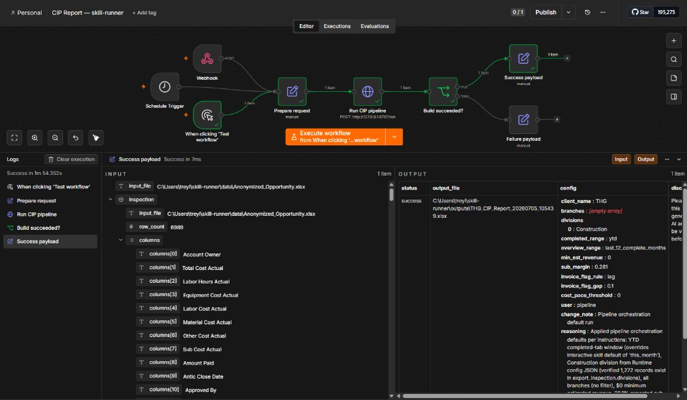
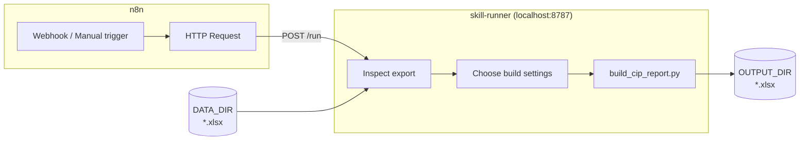

# skill-runner

**skill-runner** is a local prototype for turning a packaged Agent Skill into a repeatable reporting pipeline. Its current use case is a Construction In Process (CIP) report: it reads an Aspire Opportunity Excel export and produces a nine-sheet workbook for reviewing job progress, backlog, costs, invoicing, and completed work.

The project addresses a practical reporting problem: analysts need to turn the same type of operational export into a consistent report without walking through an interactive skill session for every run. The runner inspects the input, selects report settings from documented defaults and optional request overrides, and executes the Python script bundled with the skill. **n8n** provides a manual or webhook trigger; **OpenRouter** can help choose settings, but the pipeline also works with local defaults when no API key is configured.

This repository is a proof of concept for that workflow and a foundation for adding other script-backed reporting skills. The CIP report is the only bundled report today. The workbook should be reviewed by a person before it is used to make or communicate financial decisions.

## What the prototype produces

The bundled [CIP skill](skills/cip-report-06-03-26-tl.skill) builds a workbook with a dashboard, job-level and property-level in-process views, completed-job views, a complete overview, a source-data table, a disclosure sheet, and version history. The report highlights potential budget, labor, and invoicing issues so an analyst can investigate them in the underlying data.

One [documented end-to-end run](docs/BASELINE-VALIDATION-2026-08-09.md) processed 6,989 anonymized rows through n8n and the local runner in 133.8 seconds. That result describes the tested prototype, not a guaranteed runtime for other exports.



## How it works


```mermaid
flowchart LR
  subgraph n8n
    T[Webhook / Manual trigger]
    H[HTTP Request]
    T --> H
  end
  subgraph skill_runner["skill-runner (localhost:8787)"]
    I[Inspect export]
    O[Choose build settings]
    B[build_cip_report.py]
    I --> O --> B
  end
  D[(DATA_DIR\n*.xlsx)]
  OUT[(OUTPUT_DIR\n*.xlsx)]
  H -->|POST /run| I
  D --> I
  B --> OUT
```

1. Put an Aspire Opportunity `.xlsx` in your data folder.
2. n8n calls `POST /run` on the local runner.
3. The runner checks the export's required columns and available divisions, branches, and statuses. It chooses build settings through OpenRouter when configured, or uses local defaults, then applies any request overrides.
4. The runner executes the build script from the packaged skill. The finished workbook lands in `OUTPUT_DIR`; the API response includes its path and the settings used.

The skill supplies the report-building script and its reporting rules. The runner handles input discovery, configuration, and execution. The script calculates the workbook from the selected export and settings. By default, output files are named `CIP_Report_YYYYMMDD_HHMMSS.xlsx`; set `OUTPUT_FILENAME_PREFIX` in `.env` to change the prefix.

Each completed run also writes a JSON manifest under
`OUTPUT_DIR/run-manifests/`. The manifest records input and output hashes,
configuration, row counts, workbook structure, timing, skill-package identity,
and Git state. Failed runs write a failure manifest without masking the original
pipeline error.

## Setup

```powershell
python -m venv .venv
.\.venv\Scripts\Activate.ps1
pip install -r requirements.txt
copy .env.example .env
```

Run these commands from the repository root. The copied `.env.example` contains example `DATA_DIR` and `OUTPUT_DIR` paths: change them to folders on your machine, or remove those two lines to use the repository's `./data` and `./outputs` defaults. Set `OPENROUTER_API_KEY` to enable model-assisted configuration, or leave it blank to use the local defaults. `LOGO_PATH` is optional (blank means no logo).

Drop your export in the data folder, then start the API:

```powershell
python run_server.py
```

Health check: [http://127.0.0.1:8787/health](http://127.0.0.1:8787/health)

## n8n

Start n8n:

```powershell
npx n8n start
```

To sync the bundled workflow through the n8n API, add an n8n API key to `.env` (create one in n8n: **Settings → n8n API**):

```env
N8N_API_KEY=your-key-here
N8N_BASE_URL=http://127.0.0.1:5678/api/v1
```

Push workflow changes without re-importing:

```powershell
python -m runner.cli n8n-sync
```

On first sync the workflow is created; later runs update it by name (or set `N8N_WORKFLOW_ID` in `.env`).

Set the **Run CIP pipeline** URL in n8n if needed:

- n8n in Docker: `http://host.docker.internal:8787/run`
- n8n on Windows (no Docker): `http://127.0.0.1:8787/run`

Use **Test workflow** or POST to the webhook:

```json
{
  "filename": "Client_Opportunity.xlsx",
  "client_name": "Acme Corp",
  "user": "Trey",
  "overrides": {
    "completed_range": "ytd",
    "sub_margin": 0.281
  }
}
```

Omit `filename` to use the newest `.xlsx` in `DATA_DIR`.

## CLI

```powershell
python -m runner.cli inspect
python -m runner.cli orchestrate --client-name "Acme Corp"
python -m runner.cli run --client-name "Acme Corp"
python -m runner.cli n8n-sync
```

## API

| Method | Path | Purpose |
|--------|------|---------|
| GET | `/health` | Liveness |
| GET | `/data` | List `.xlsx` files in `DATA_DIR` |
| POST | `/inspect` | Read export headers and value counts |
| POST | `/orchestrate` | OpenRouter pre-flight decisions |
| POST | `/build` | Run build with explicit config |
| POST | `/run` | Inspect → orchestrate → build |

### POST `/run` body

```json
{
  "filename": "optional.xlsx",
  "client_name": "Client Name",
  "user": "Trey",
  "overrides": {
    "divisions": ["Construction", "Enhancement"],
    "completed_range": "this_month",
    "overview_range": "last_12_complete_months",
    "sub_margin": 0.281,
    "cost_pace_threshold": 0.05
  }
}
```

## Data folders

Point `DATA_DIR` and `OUTPUT_DIR` anywhere on disk:

```env
DATA_DIR=C:/path/to/aspire-exports
OUTPUT_DIR=C:/path/to/cip-reports
```

Restart the server after changing `.env`.

## OpenRouter

The runner sends the skill's pre-flight checks, `runner/cip-orchestration.md` defaults, and export inspection data to OpenRouter.

Without `OPENROUTER_API_KEY`, it uses local pipeline defaults, including Construction only, all branches, a year-to-date Completed tab, a last-12-complete-months overview, and a 28.1% expected subcontractor margin. Edit the JSON in [`runner/cip-orchestration.md`](runner/cip-orchestration.md) to change the configured division; request `overrides` take precedence for an individual run.

```env
OPENROUTER_MODEL=anthropic/claude-sonnet-4
```

## Skill packaging

The skill ships as `skills/cip-report-06-03-26-tl.skill` (a ZIP archive). On first run the runner extracts it to `.runner-cache/` and runs the build script from there — no Cursor install needed.

Replace the `.skill` file and restart to update. Pipeline defaults live in `runner/cip-orchestration.md`.

## Project scope and documentation

This is a local, single-report prototype. It demonstrates unattended execution and repeatable report generation. Production authentication and a full security review remain outside its current scope. See the [baseline validation](docs/BASELINE-VALIDATION-2026-08-09.md), [validation report](docs/VALIDATION-REPORT.md), [performance evaluation](docs/PERFORMANCE-EVALUATION.md), and [unit-testing notes](docs/UNIT-TESTING.md) for the evidence and limits of the current implementation. The [capstone checklist](CAPSTONE-CHECKLIST.md) tracks the broader project deliverables.

