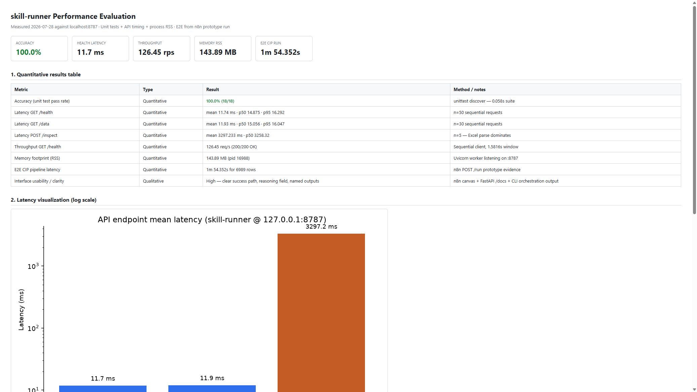
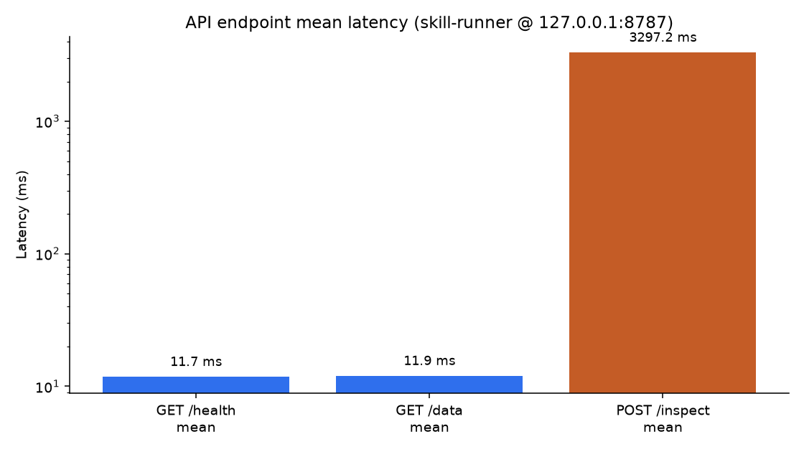
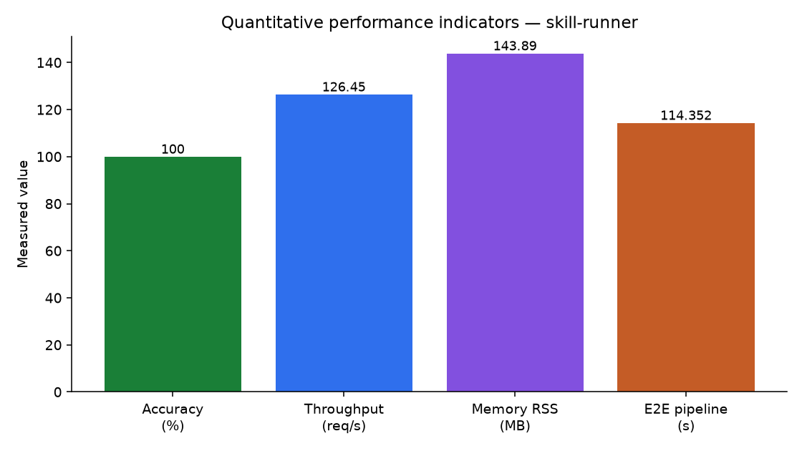
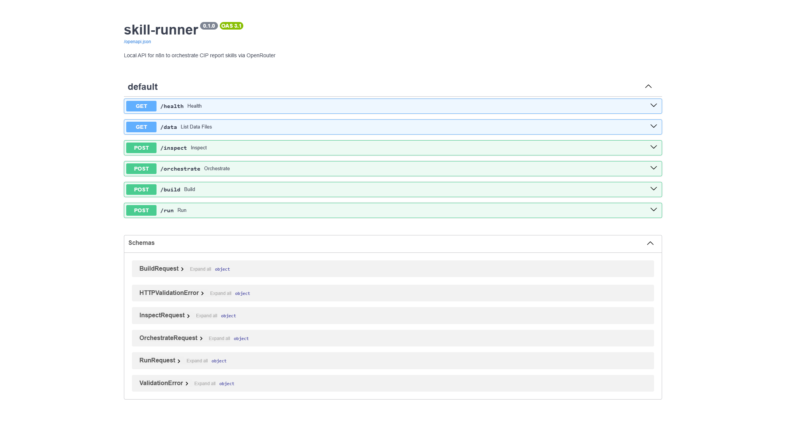
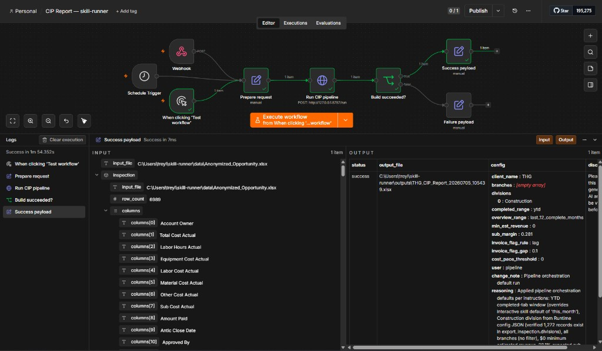

# Performance Evaluation — skill-runner

**System under test:** deterministic CIP report skill-runner (FastAPI on `127.0.0.1:8787` + n8n trigger)  
**Evaluation date:** 2026-07-28  
**Evidence folder:** [`docs/images/`](images/) · raw metrics: [`outputs/performance-eval.json`](../outputs/performance-eval.json)

---

## 1. Quantitative metrics

### 1.1 Accuracy — unit test pass rate

| Result | Detail |
|--------|--------|
| **100%** | 18/18 tests passed in 0.058s |

### 1.2 Latency & throughput

| Metric | Result | Method |
|--------|--------|--------|
| GET `/health` latency | mean **11.74 ms**, p50 14.875, p95 16.292 | n=50 sequential |
| GET `/data` latency | mean **11.93 ms**, p50 15.056, p95 16.047 | n=30 sequential |
| POST `/inspect` latency | mean **3297 ms** (~3.3 s) | n=5; Excel parse dominates |
| Throughput GET `/health` | **126.45 req/s** (200/200 OK) | sequential client, 1.58s |
| E2E CIP pipeline | **1m 54.352s** for 6,989 rows | n8n `POST /run` prototype |

### 1.3 Memory footprint

| Metric | Result |
|--------|--------|
| Uvicorn worker RSS (LISTENING `:8787`) | **143.89 MB** (pid 16988) |
| Parent + worker total RSS | **148.45 MB** |

---

## 2. Qualitative metric — interface usability & clarity

**Rating: High**

| Observation | Evidence |
|-------------|----------|
| API surface is self-documenting (method colors, short descriptions, schemas) | FastAPI Swagger `/docs` |
| Operators see a clear success/failure path with green checkmarks and run duration | n8n workflow canvas |
| Orchestration decisions include human-readable `reasoning` | CLI / pipeline payload |
| Outputs use dated, client-prefixed filenames in a dedicated folder | `outputs/` reproducibility set |

---

## 3. Results table & interpretation

| # | Metric | Type | Result | Verdict |
|---|--------|------|--------|---------|
| 1 | Accuracy (unit test pass rate) | Quantitative | 100% (18/18) | Pass |
| 2 | Control-plane latency (`/health`, `/data`) | Quantitative | ~12 ms mean | Pass |
| 3 | Throughput (`/health`) | Quantitative | 126.45 req/s | Pass |
| 4 | Memory footprint (RSS) | Quantitative | 143.89 MB | Acceptable for prototype |
| 5 | Workbook inspect latency | Quantitative | ~3.3 s | Expected (I/O bound) |
| 6 | E2E CIP generation | Quantitative | ~114 s / 7k rows | Fit for batch reporting |
| 7 | Interface usability / clarity | Qualitative | High | Pass |

**Interpretation:** Control-plane performance is strong (low latency, solid throughput, full unit-test accuracy) and memory use is modest for a Python Excel pipeline. End-user wait time is dominated by workbook inspection and CIP build (~2 minutes for ~7k rows), not by the API layer. Qualitatively, the n8n + Swagger + reasoned CLI outputs make the system easy to operate and audit for a technical analyst.

Full interactive report: [performance-evaluation.html](images/performance-evaluation.html)
